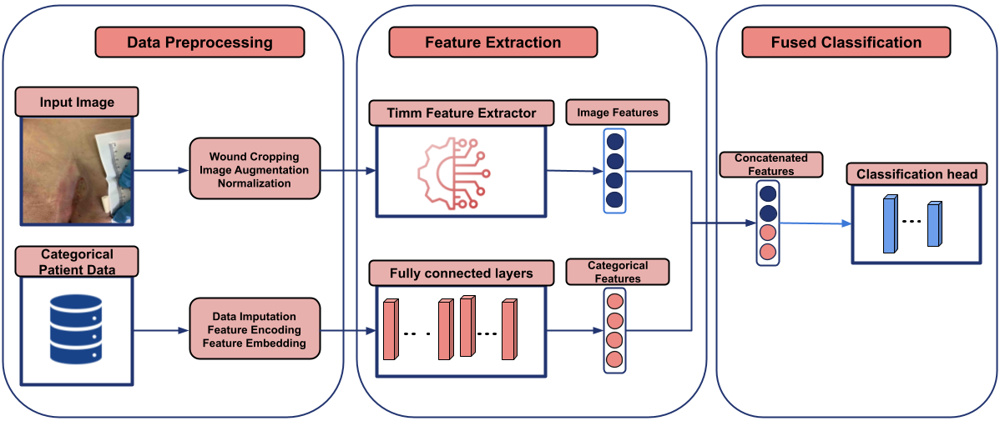

# Multimodal Deep Learning for Fine-Grained Classification of Pressure Ulcers and Incontinence-Associated Dermatitis

This repository contains the code and pretrained model weights for the study: **"Multimodal Deep Learning for Fine-Grained Classification of Pressure Ulcers and Incontinence-Associated Dermatitis: Algorithm Development and Validation Study"**.

## Overview

The aim of this project is to develop a deep learning framework for classifying pressure ulcers (PU) and incontinence-associated dermatitis (IAD) using wound images and patient data. Our model leverages convolutional and transformer-based architectures to achieve high accuracy in distinguishing between these wound types and their respective severities.



## Features

- **Binary classification** between Pressure Ulcers (PU) and Incontinence-Associated Dermatitis (IAD).
- **Fine-grained classification** of wound severities.
- Integration of **multimodal data** (images + patient information) for improved diagnostic accuracy.
- Pretrained models available for **TinyViT** and **ConvNeXtV2** architectures.


## How to make a prediction:

### Install dependencies
```bash
conda env install --file environmet.yml
```
### Make Binary Prediction
```bash
python inference.py --image_path='./example_images/example_image.jpeg'
```
